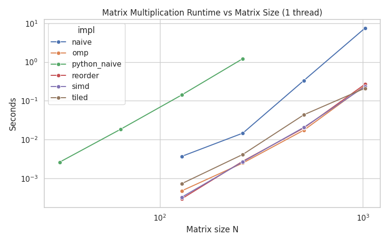
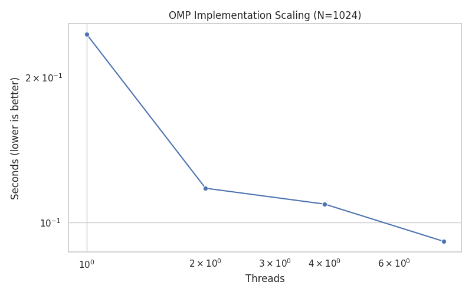

# ⚙️ Matrix Multiplication Profiling

A performance comparison project demonstrating how **progressive optimizations** improve matrix multiplication speed — from **naive Python loops** to **optimized C with SIMD, tiling, and OpenMP parallelization**.

---

## 📸 Screenshots

| Runtime vs Size | OpenMP Scaling |
|:----------------:|:---------------:|
|  |  |

---

## 🧩 Implementations
Each stage builds upon the previous to demonstrate the impact of algorithmic and hardware-level optimizations:

| Step | Implementation | Description |
|:----:|:----------------|:------------|
| 1️⃣ | **python_naive** | Simple triple-loop in pure Python |
| 2️⃣ | **naive_c** | Direct translation of the naive algorithm into C |
| 3️⃣ | **reorder_c** | Loop reordering for better cache access patterns |
| 4️⃣ | **omp_c** | Adds multithreading with OpenMP |
| 5️⃣ | **tiled_c** | Cache blocking (tiling) for L2/L3 cache efficiency |
| 6️⃣ | **simd_c** | SIMD vectorization using AVX2 intrinsics |

---

## ⚙️ Requirements

- **C++11/C11** compiler (GCC ≥ 9, Clang ≥ 10)
- **CMake ≥ 3.16**
- **Python ≥ 3.8**
- **Matplotlib**, **pandas**, **seaborn**

---

## 🧱 Build & Run

### 1️⃣ Build the C Benchmarks
```bash
cmake -S . -B build
cmake --build build -j
```

### 2️⃣ Run C Benchmarks
```bash
cd benchmark
bash bench.sh
```

### 3️⃣ Run Python Baseline
```bash
cd python
python3 bench_python.py
```

### 4️⃣ Generate Plots
```bash
cd ../benchmark
python3 plot_results.py ../data/results.csv
```
